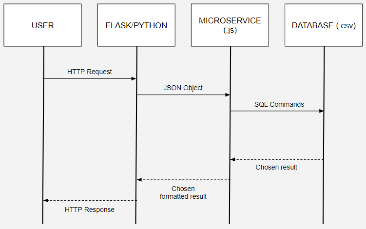

# Microservice Data Access README

This README provides clear instructions on how to programmatically request data from the microservice implemented in JavaScript and Node.js using HTTP communication, and how to access it using Flask/Python. It also includes a UML sequence diagram showing how requesting and receiving data works.

## Communication Contract

### Request Data

**Endpoint:** `GET /recipes/:recipe_id`

**Parameters:**
- `:recipe_id` (integer) - The unique ID of the recipe to retrieve.

**Response:** The microservice will respond with a JSON object representing the requested recipe if it exists, or a 404 error if the recipe with the specified ID is not found.

### Receive Data

**Endpoint:** `POST /recipes`

**Request Body:** The request body should be a JSON object representing the new recipe to create. It should have the following properties:
- `name` - The name of the new recipe.
- `user` - The name/username of the user.
- `ingredients` - The ingredients of the new recipe.
- `instructions` - The instructions to prepare the new recipe.
- `rating` - The overall rating from 0 to 5.
- `review` - The review from the user.

**Response:** The microservice will respond with a JSON object containing a message indicating the success of the operation and the unique ID assigned to the new recipe.

**Endpoint:** `PUT /recipes/:recipe_id`

**Parameters:**
- `:recipe_id` (integer) - The unique ID of the recipe to update.

**Request Body:** The request body should be a JSON object representing the updated recipe. It can have any combination of the following properties:
- `name` - The name of the new recipe.
- `user` - The name/username of the user.
- `ingredients` - The ingredients of the new recipe.
- `instructions` - The instructions to prepare the new recipe.
- `rating` - The overall rating from 0 to 5.
- `review` - The review from the user.

**Response:** The microservice will respond with a JSON object containing a message indicating the success of the operation.

**Endpoint:** `DELETE /recipes/:recipe_id`

**Parameters:**
- `:recipe_id` (integer) - The unique ID of the recipe to delete.

**Response:** The microservice will respond with a JSON object containing a message indicating the success of the operation.

## Example Usage with Flask/Python

**Example localhost:**
BASE_URL = 'http://localhost:3000'

**Example create a new recipe:**
```python
new_recipe = {
    'name': 'New Recipe',
    'user': 'username',
    'ingredients': 'Ingredient 1, Ingredient 2',
    'instructions': 'Step 1, Step 2',
    'rating': 4.0,
    'review': 'great!'
}
```

## UML

